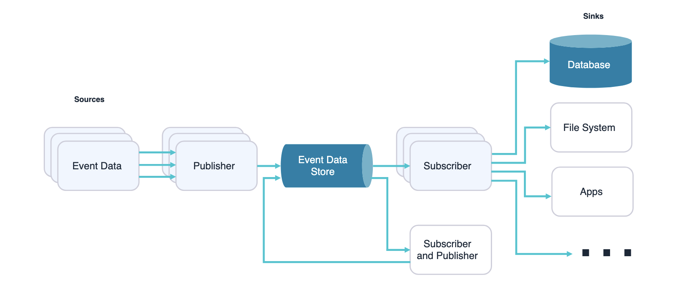

# What is Event Driven Architecture (EDA)? - Gemini Powered

Okay, let's talk about Event-Driven Architecture (EDA) from a software architect's perspective. It's not just about some fancy message queues or streams; it's a fundamental paradigm shift that impacts how we design, build, and evolve distributed systems.

At its core, **EDA is an architectural style where software components interact by producing, detecting, and reacting to events**. An "event" represents a significant change in state or an occurrence within the system or from an external source.

Think of it as a loosely coupled communication model where services don't directly call each other, but rather announce important happenings (events) to a central system (an event broker or event bus). Other services interested in those specific events can then subscribe and react to them independently.

## Key elements of EDA

EDA involves three main components:

1.  **Event Producers:** Generate and publish events to the event broker.
2.  **Event Consumers:** Subscribe to and process specific events from the broker.
3.  **Event Broker/Bus:** Acts as an intermediary, routing events from producers to consumers. Examples include Apache Kafka, Amazon Kinesis, and RabbitMQ.

Events can be organized into a continuous sequence called an **Event Stream**.

## EDA vs. Traditional architectures

EDA differs from traditional request-response architectures through:

*   **Asynchronous Communication:** Components interact without waiting for immediate responses.
*   **Loose Coupling:** The event broker facilitates indirect communication, reducing dependencies.
*   **Scalability & Performance:** Asynchronous processing enables better handling of high data volumes.

## Benefits from an architectural lens

EDA offers several architectural advantages:

1.  **Scalability & Flexibility:** Services can scale independently.
2.  **Real-Time Responsiveness:** Systems can react to events instantly.
3.  **Resilience & Fault Tolerance:** Decoupling helps the system continue operating even if a component fails.
4.  **Extensibility & Agility:** New features can be added with minimal impact.
5.  **Auditing & Traceability:** Events create a record of system changes for auditing and debugging.
6.  **Integration of Disparate Systems:** EDA can integrate systems using different technologies.

## Challenges to consider

However, EDA also presents challenges:

1.  **Increased Complexity:** Managing event flows in distributed systems can be complex.
2.  **Event Ordering & Consistency:** Ensuring correct event order and data consistency across services requires careful design.
3.  **Debugging & Monitoring:** Tracing events across multiple services can be difficult without robust tools.

## When to use EDA

EDA is suitable for scenarios requiring:

*   **Real-time Applications:** Systems needing immediate reactions to triggers.
*   **Scalable Applications:** Systems handling potentially high volumes of events.
*   **Decoupled & Modular Systems:** Architectures like microservices.
*   **Complex Event Processing:** Analyzing event series for patterns or decisions.
*   **Integrating Heterogeneous Systems:** Sharing information between systems on different platforms.

In summary, EDA is a powerful architectural style for building responsive, resilient, and scalable distributed systems by focusing on event-based communication.